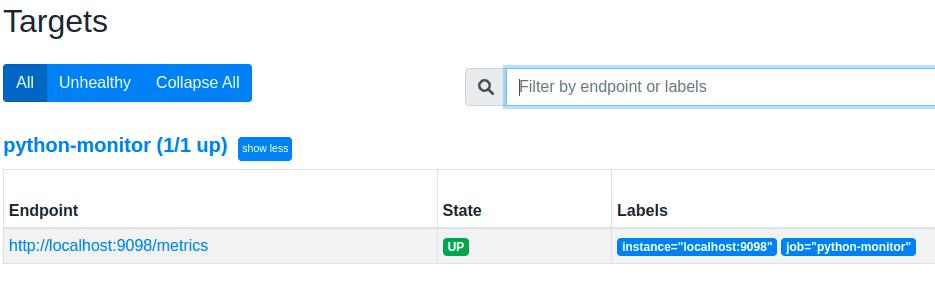
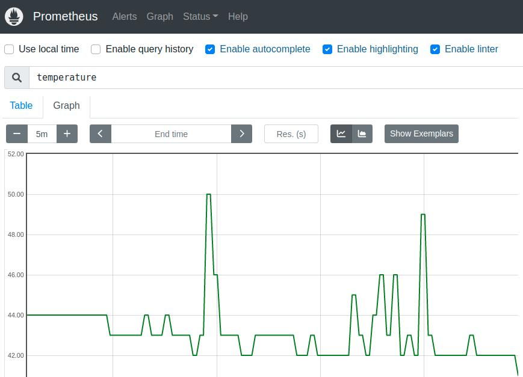

# Ejemplos de clase

En esta práctica utilizaremos el repositorio de prometheus que hemos preparado para este curso.

Logearse desde VM y obtener cual es la dirección IP del dispositivo:
```sh
$ ifconfig
```

### 1 - Preparar el entorno de trabajo

Abrir el Visual Studio Code y conectarse de forma remota al dispositivo. Trabajaremos sobre la carpeta recientemente clonada de este repositorio.

Clonar el repositorio de prometheus:
```sh
$ git clone https://github.com/InoveAlumnos/prometheus_monitoreo
```

Topicos que soporta que utilizaremos de este sistema:
|             |             | datos ejemplo
| ----------  | --------    | -----
|  sensores   | monitoreo   | {"temp": 37, "ram": 80, "cpu": 40, "disk": 70, "uptime": 150}


### 2 - Lanzar el docker de Prometheus
Ingrese a la carpeta "prometheus_monitoreo" y ejecute el siguiente comando para lanzar el sistema:
```sh
$ docker-compose up
```
- Esa terminal le quedará tomada hasta que cierre el prometheus.


### 3 - Visualizar la telemetría que exporta el Prometheus
Para visualizar los datos del Prometheus exporter abrir el explorador e ingresar a la siguiente URL:
```
http://<ip_VM>:9098/metrics
```

Observar:
- Los datos no se actualizan al menos que usted haga un F5 (get)
- Puede ver que los datos se actulizan porque el updatetime cambia cada 2 segundos.


### 4 - Visualizar la telemetría en el dashboard Prometheus Server
Para visualizar la telemetría en el dashboard del Prometheus abrir el explorador e ingresar a la siguiente URL:
```
http://<ip_VM>:9090
```

Ingresar al menú "Status --> Targets" para ver si su servicio de Prometheus exporter sigue vivo:




Si todo está ok, ingresar al menu "Graph" y verá un buscador (lupita):
- En el buscador puede encontrar toda la telemetría informado, en este caso busque por:
```
temperature
```
- Presione el botón "Execute" y ajuste para ver los últimos 5minutos (5min) sin fecha de "End time":



- El sistema solo actualiza el gráfico cada vez que presione "Execute"
- Puede explorar otras métricas como el updatetime que siempre aumenta.


### 5 - Ensayar los tópicos de MQTT
Utilizar el MQTTExplorar y verificar de esta manera el correcto funcionamiento de la publicación de los datos de monitoreo en el tópico:
```
sensores/monitoreo
```

### 6 - Publicar monitoreo en el dashboard
Desde el VSC abrir el script de "ejemplo_4_monitoreo.py", el cual viene con todo el sistema resuelto de bridge y logging.
- Dentro de la función "on_connect_local" agregue la suscripción al tópico de monitoreo:
```
client.subscribe("sensores/monitoreo")
```

- Verifique en el dashboardiot si en el menú de estado/salud se está informando el estado del sistema.